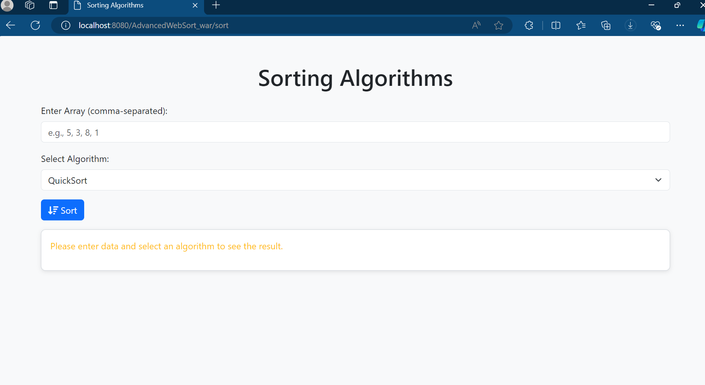
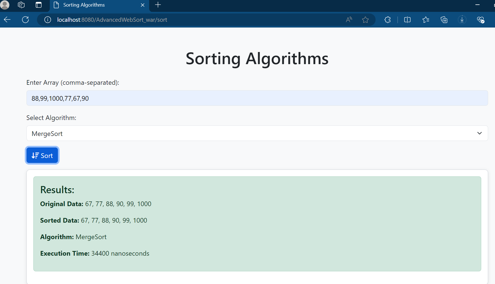

# Advanced Web Sort built with [Core Spring Framework](https://spring.io) and [JavaServer Pages (JSP)](https://www.baeldung.com/guide-to-java-server-pages-jsp)

## Overview

This project involves developing a web application that manages and processes data through a RESTful API, utilizing the Spring Framework for modular development and incorporating various sorting algorithms. The system is deployed on Apache Tomcat and adheres to HATEOAS principles to ensure robust API interactions. The application supports CRUD operations on a sample dataset and allows users to execute different sorting algorithms.

## Project Goal

The goal of this project is to design and build a web application that provides a RESTful API for managing data, integrates sorting algorithms for data processing, and utilizes the Spring Framework for modular development. The application is deployed on an Apache Tomcat server to handle HTTP requests and responses efficiently.

## Major Features 🔑

### RESTful API:
- **CRUD operations** for managing a sample dataset.
  
  **Sorting Algorithms:**
  - **BucketSort**  
    `POST http://localhost:8080/AdvancedWebSort_war/api/sort/bucketSort`  
    Request Body:  
    ```json
    {
      "data": [34, 12, 4, 56, 7, 23, 90]
    }
    ```
    
  - **QuickSort**  
    `POST http://localhost:8080/AdvancedWebSort_war/api/sort/quickSort`  
    Request Body:  
    ```json
    {
      "data": [34, 12, 4, 56, 7, 23, 90]
    }
    ```
  
  - **MergeSort**  
    `POST http://localhost:8080/AdvancedWebSort_war/api/sort/mergeSort`  
  
  - **HeapSort**  
    `POST http://localhost:8080/AdvancedWebSort_war/api/sort/heapSort`  
  
  - **RadixSort**  
    `POST http://localhost:8080/AdvancedWebSort_war/api/sort/radixsort`  

### Spring Framework Integration:
- Utilizes Spring's **dependency injection**, **autowiring**, and **application context** for modular and maintainable code.

### Sorting Algorithms:
- Implements and integrates multiple sorting algorithms: **Heap Sort**, **Quick Sort**, **Merge Sort**, **Radix Sort**, and **Bucket Sort**.

### User Interface for Sorting:
- Provides a simple interface to select and execute different sorting algorithms on a sample dataset.

#### Input Page:
On this page, you can input a set of numbers (Array) separated by commas and select the sorting algorithm you want to use. After clicking the **Sort** button, you will get the results.



#### Results Page:
This page displays your sorted data, the algorithm used, and the execution time in nanoseconds.



### Deployment on Apache Tomcat:
- Configures and deploys the web application on an Apache Tomcat server for efficient handling of HTTP requests and responses.

## Technical Stack
- **Java**
- **Core Spring Framework**
- **Apache Tomcat**
- **JSP**
- **IDE** (IntelliJ IDEA, Eclipse, etc.)
- **Maven**

## Installation

1. Clone the repository:

    ```bash
    git clone https://github.com/mawule-gabriel/AdvancedWebSort.git
    ```

2. Navigate to the project directory.

3. Build the project using Maven:

    ```bash
    mvn clean install
    ```

4. Deploy the application on Apache Tomcat.

5. Access the application via `http://localhost:8080/AdvancedWebSort_war`.

---

Feel free to contribute to this project or open issues if you encounter any bugs or have suggestions for improvement.
